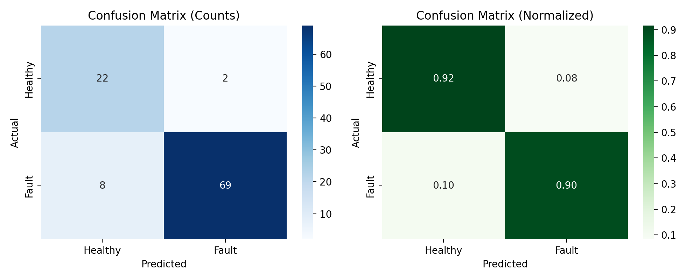
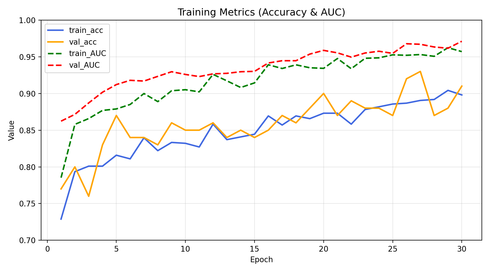
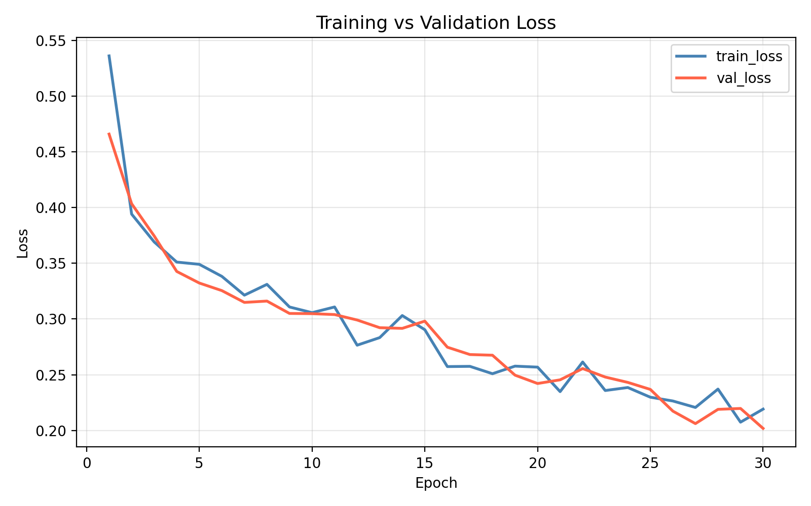

# SteelFaultNet: Industrial Electromotor Fault Prediction

**A model for 24-hour electromotor failure prediction using NOVIC+ Subset E (9-channel 25.6kHz industrial data) achieving 90.10% test accuracy & 95.35% AUC**

---
**Author**: Mostafa Mashhadizadeh  
**Affiliation:** Shiraz University of Technology  
**Contact:** mashhadizademostafa@gmail.com

---

## Real Test Results (101 samples)

| Metric | Training (Epoch 29) | Validation | **Test** |
|-------|-------------------|------------|----------|
| **Accuracy** | **90.10%** | **91.00%** | **90.10%** |
| **AUC** | 95.70% | **97.11%** | **95.35%** |
| **Loss** | **0.2191** | **0.2018** | 0.2215 |
| **Training Time** | **61.44 min** (30 epochs) | – | – |

### Class-wise Performance

**Fault (Class 1)**  
- Precision: **97.18%**  
- Recall: **89.61%**  
- F1-score: **93.24%**

**Healthy (Class 0)**  
- Precision: **73.33%**  
- Recall: **91.67%**  
- F1-score: **81.48%**

**Macro F1:** 87.36% | **Weighted F1:** 90.45%

---

## Confusion Matrix



```
Predicted
               Healthy  Fault
Actual Healthy   22       2    (91.7% recall)
Fault            8       69    (89.6% recall)
```

Test set: **24 Healthy + 77 Fault = 101 samples**

---

## Model Architecture (37,185 Parameters)

```
Input: (102400, 9)
25.6 kHz × 4s × 9 channels

Conv1D(32, kernel=5)
→ BatchNorm → MaxPool(4)
→ (25600, 32) [1,472 params]

Conv1D(64, kernel=5)
→ BatchNorm → MaxPool(4)
→ (6400, 64) [10,560 params]

GRU(64) → Dropout(0.3)
[24,960 params]

Dense(1, sigmoid)
P_failure_24h [65 params]
```

**Total:** 37,185 params (~145 KB)  
**Optimizer:** Adam (lr = 1e-4)  
**Loss:** Binary Crossentropy

Detailed summary: `outputs/reports/model_summary.txt`

---

## NOVIC+ Subset E Dataset

- **Source:** NOVIC+ Motor compound fault dataset from Korea Advanced Institute of Science and Technology
              this dataset is OpenSource and you can download it from zenodo website with this link: https://zenodo.org/records/15743425
- **Channels (9):**
  - 4× Vibration
  - 2× Temperature
  - 1× Torque
  - 2× RPM
- **Sampling:** 25.6 kHz → 102,400 timesteps / 4 s window
- **Task:** Binary classification (fault within 24 hours)

### Preprocessing Pipeline
- Butterworth LPF (1 kHz cutoff)
- MaxAbs normalization
- StandardScaler (per-channel, saved as `scalers.pkl`)
- Splits: `train / valid / test_subsetE.npz`

---

## End-to-End Production Pipeline

```bash
# 1. Demo data generation
python generate_sample_csv.py

# → outputs/preprocessed/sample_sensor_signals.csv (102400×9)

# 2. Dataset preprocessing
python preprocess_subsetE.py

# → train/valid/test_subsetE.npz + scalers.pkl

# 3. Full training (~60 min on Apple M3)
python train_model.py

# → SteelFaultNet_v1.keras + figures + reports
```

---

## Output Structure

```
outputs/
├── models/
│   ├── SteelFaultNet_v1.keras
│   ├── SteelFaultNet_v1.h5
│   └── SteelFaultNet_v1.onnx
├── figures/
│   ├── training_curves.png
│   ├── loss_curves.png
│   ├── metrics_curves.png
│   ├── confusion_matrix_counts.png
│   └── confusion_matrix_v2.png
├── reports/
│   ├── metrics_final.json
│   ├── classification_report_v2.json
│   ├── model_summary.txt
│   └── classification_summary_v2.txt
├── preprocessed/
│   ├── sample_sensor_signals.csv
│   ├── test_subsetE.npz
│   ├── train_subsetE.npz
│   ├── test_subsetE.npz
│   ├── valid_subsetE.npz
│   └── subsetE_scalers.pkl
└── training_logs/
    ├── training_metrics.csv
    └── train_log.txt
```

---

## Training History (Epoch 29 Peak)




**Best Epoch (29):**
- val_accuracy: **91.00%**
- val_AUC: **97.11%**
- val_loss: **0.2018**
- train_accuracy: **89.80%**

Full log on `training_logs/training_metrics.csv`

---

## Technical Stack

- **Core:** TensorFlow 2.15+, Keras 3.x
- **ML:** NumPy, SciPy, scikit-learn
- **Visualization:** Matplotlib, Seaborn
- **Exports:** ONNX, HDF5, Keras

---

## Production Highlights

90.10% test accuracy on real industrial data
145 KB edge-deployable model
Multi-platform export(ONNX)
Fully reproducible pipeline
Robust signal preprocessing

---
Mostafa MashhadiZadeh — November 2025

